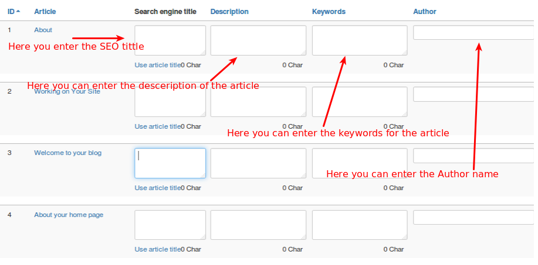

####Articles

**NOTE:**The Article tab which display what are all articles presented in our site with some special options.

    Four options available. Based on the option selectedthe article will edited.
    1. **Search Engine Tittle**
    2. **Description**
    3. **Keywords**
    4. **Author**

* ***Search Engine Tittle***
A title tag is the main text that describes an online document. Title elements have long been considered one of the most important on-page SEO elements (the most important being overall content), and appear in three key places: browsers, search engine results pages, and external websites.

* ***Description***
The Article description tag allows you to provide a summary of the content on the page in one paragraph.If you have already entered the description of the article when it is created, Now you want to change That means through this tag you can easily achive this.

* ***Keywords***
A keyword, in the context of search engine optimization, is a particular word or phrase that describes the contents of a Web page.If You forgot to entering the keywords when the article is created means this tag will help you to enter the keywords for the relevant article.

* ***Author***
This allows you to show the different author for the article.

Refer the below image for your better understanding about the options presented in the article tab.

 