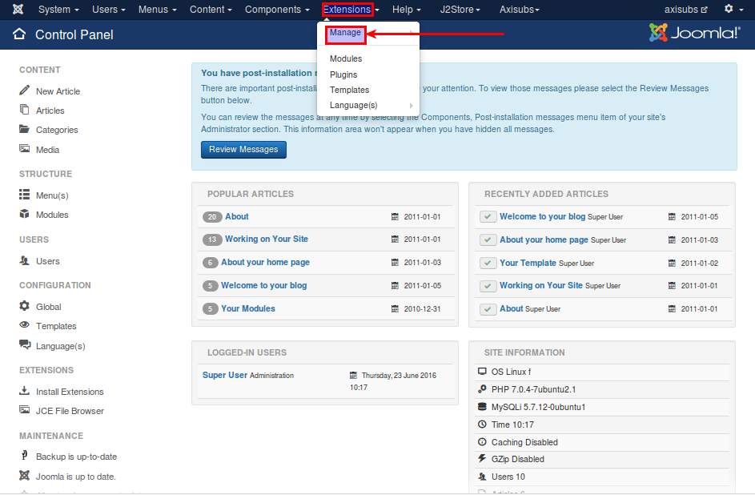
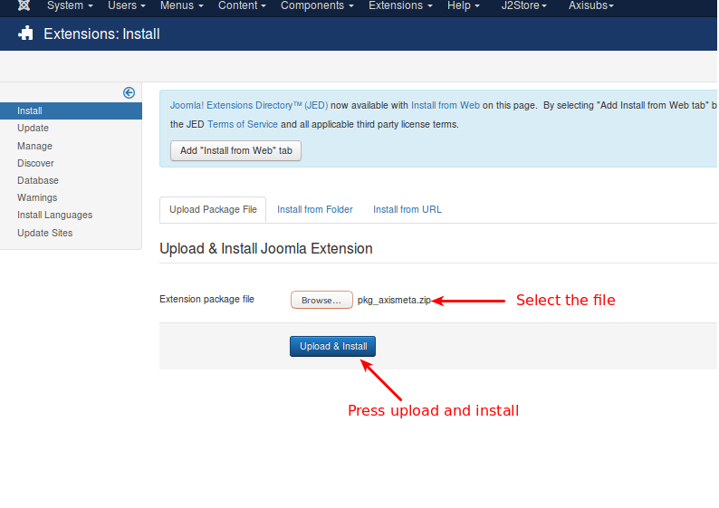
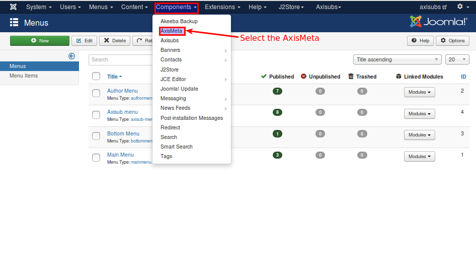

#### Installation

* Download the AxisMeta component and install it using Joomla installer (Extensions > Manage > Install)

Refer the below image

* Click **Choose file** to choose the downloaded / purchased package.

* Click Upload & Install to install the package. Refer the below image
 

* Once the upload successfull message displayed, select the AxisMeta from component list. Refer the below image
