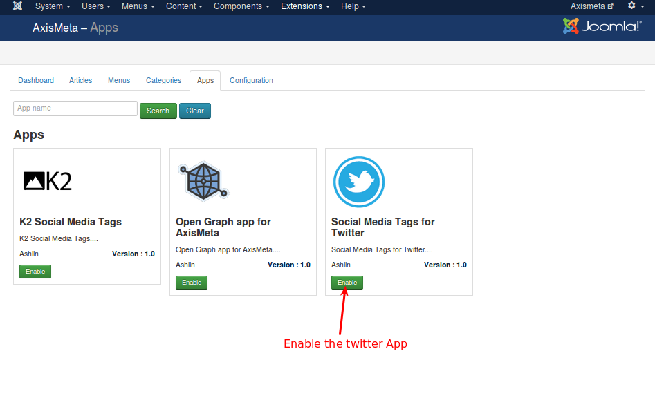
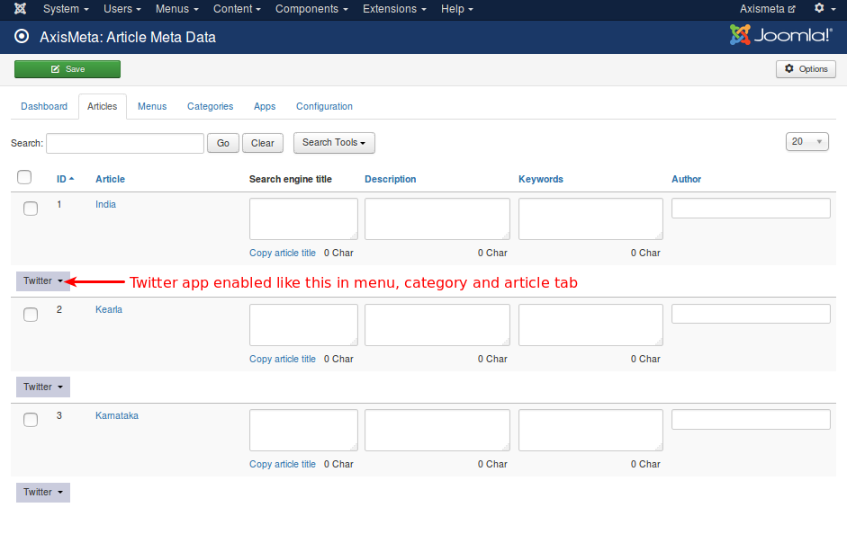
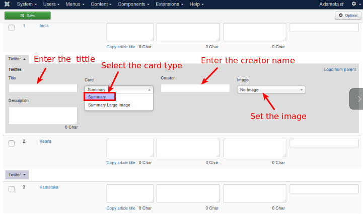
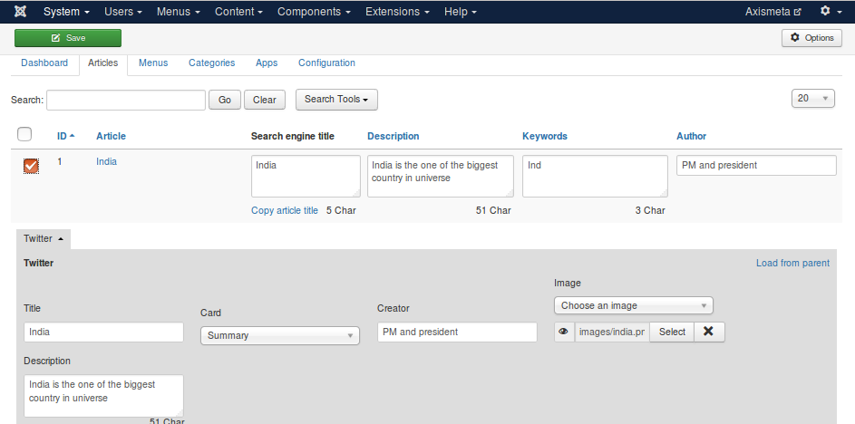
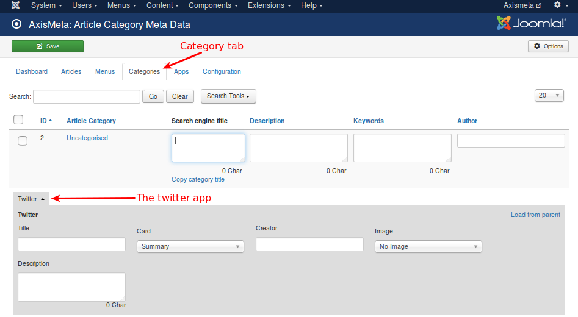
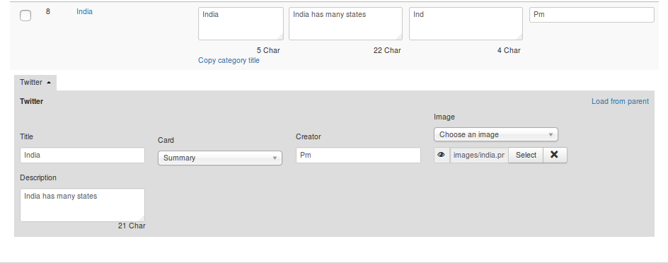
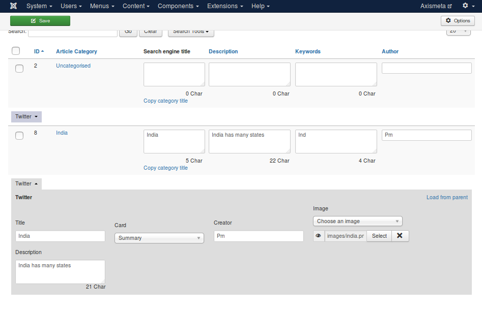

# Social media tags for Twiiter

##### What is Twitter cards ?

Twitter Cards, you can attach rich photos to Tweets that drive traffic to your website. Simply add a few lines of HTML to your webpage, and users who Tweet links to your content will have a “Card” added to the Tweet that’s visible to all of their followers.

##### Drive engagement from your Tweets

The below Card types have a beautiful consumption experience built for Twitter’s web and mobile clients

+ Summary Card: Title, description, thumbnail, and Twitter account attribution.
+ Summary Card with Large Image: Similar to a Summary Card, but with a prominently featured image.

##### Working with twitter application

Install the app using Joomla installer and once installed, go to Axis meta -> App -> select the social media tags for twitter and click **Enable** to activate the app. Refer the below image

Once the twitter app activated, you will get additonal tab named with **Twitter** under each artice / menu / category in all the following tabs Articles / Menus / Categories. Refer the below image

The twitter app offers you the features like tittle, card, creator, image and description.

+ Tittle: Title or alternate title of post

+ Card:It has 2 type of card
+ 1) Summary Card: Title, description, thumbnail, and Twitter account attribution.

+ 2) Summary Card with Large Image: Similar to a Summary Card, but with a prominently featured image.

+ Creator : Creator name of the post

+ Description :  Brief description in less than 200 characters

+ Image    : URL of image to use in the card. Image must be less than 1MB in size.

Refer the below image for getting more idea about this

##### Twitter app in article

Axis meta ->Dashboard -> Article -> The list of Published Articles in the backend will be displayed. Additionally, it will have one more tab that is Twitter.

Refer the below image

Twitter app in the articles it might have some options like tittle, card, creator, image, and description.
Except image all the options are same for menu and category.

+ Images :It have 4 options

+ 1)No image:someone not intrested to share the images in the social media, for those people this option will help. 

+ 2)Introtext: This option load the images from the intro text field.

+ 3)Description: This option load the image from description field.

+ 4)choose an image: This option will help you for selecting the images from specific folder.

After completion of data entering select, the article and press save button.

##### Twitter app in the category

Axis meta ->Dashboard ->category -> The list of Published categories in the backend that will be displayed in the list view. Additionally, it will have one more tab that is Twitter.

Refer the below image

Fill/enter the data in required fields and after completing, press save.

##### Twitter app in Menu

Axis meta ->Dashboard ->Menu -> Menu you have published will be displayed. Additionally, it will have one more tab that is Twitter.

Refer the below image

After enter the data select the menu and press save.

