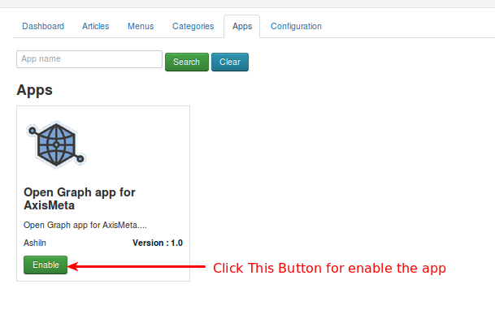

####Apps

 AxisMeta just rolled out a couple of new apps that are going to make managing your online business even easier.

* ***Open Graph app for AxisMeta***
The Open Graph protocol enables any web page to become a rich object in a social graph. For instance, this is used on Facebook to allow any web page to have the same functionality as any other object on Facebook.

While many different technologies and schemas exist and could be combined together, there isn't a single technology which provides enough information to richly represent any web page within the social graph.

The Open Graph protocol builds on these existing technologies and gives developers one thing to implement. Developer simplicity is a key goal of the Open Graph protocol which has informed many of the technical design decisions.

Refer the below image

