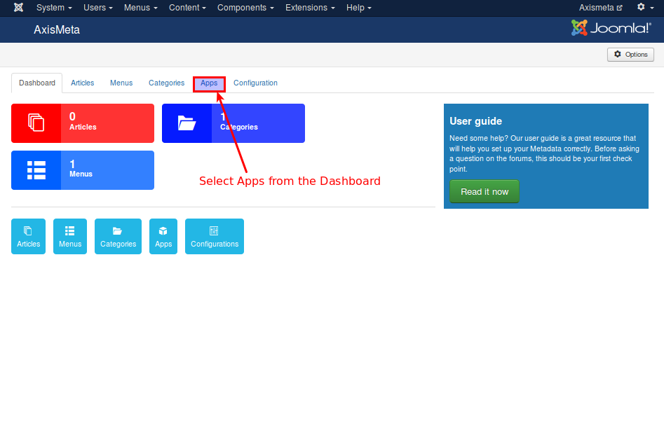
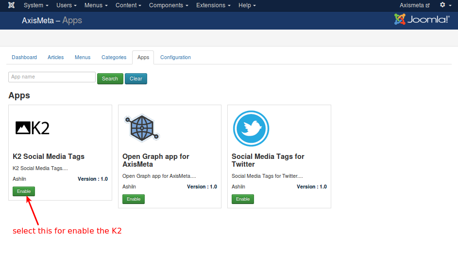
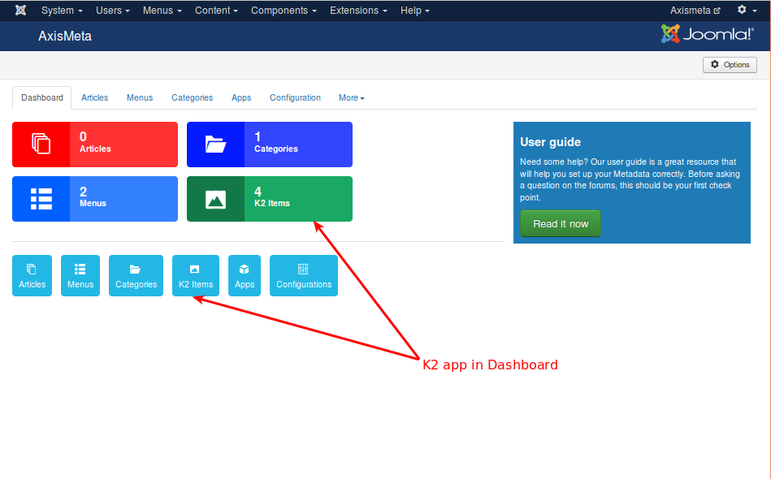
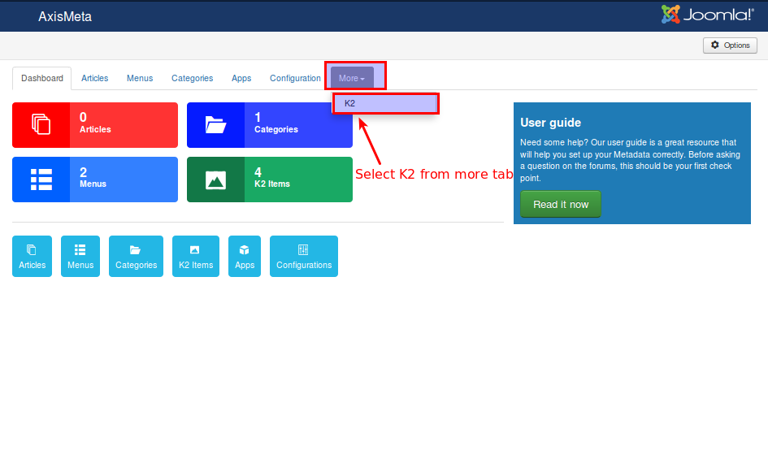
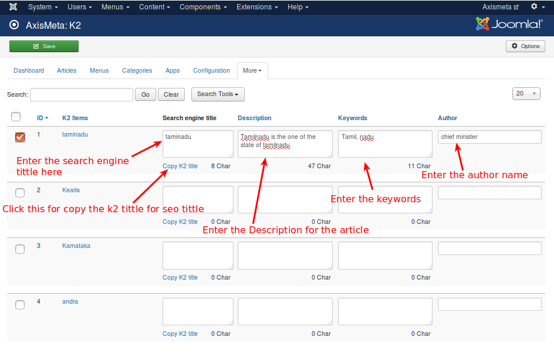
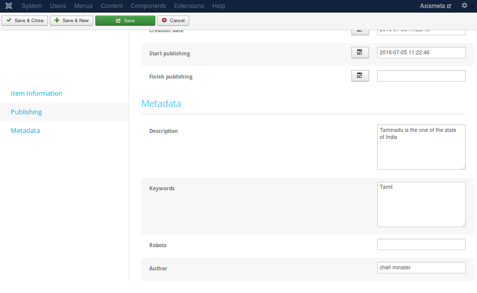

# K2 Application in Axis Meta

##### What is K2 ?

K2 Store is Simple, Smart, Easy Shopping Cart.K2 Store is a powerful, flexible online store platform for small businesses. It is built on the award winning Joomla content management system and uses the K2 Content Construction Kit for managing product catalog. It provides you with the tools you need to design and operate your online store in the way you want.

##### Working with K2 app in Axis meta

Before You start working with a  K2 app you must have K2 component in your backend of your site.

Download K2 component from JED and install it using Joomla installer. Now download and install K2 app. Once installed K2 app, please do the steps given below:

##### Step 1

Select K2 app from Axismeta -> Apps -> K2. Refer the below image

Now the application Tab gets open the list of application will be displayed,  select K2 from the App list and enable it.

Now, the K2 app added to the dashboard and displayed as like below image

Now, select the K2 app from more tab. look like a below image

Now the app will list all K2 items with options to add SEO title, description, keywords and Author.

Fill all required fields and select the Item and press save button.

Now go to the component -> K2 -> Item -> Select the item -> go to the publishing & metadata tab -> now you can see all the data you have entered via K2 app.
Refer the below image

