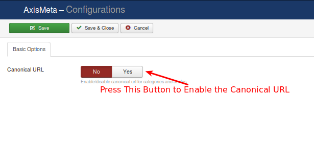

#Configuration

There are several options available for your axis meta. Any mis-configuration here will affect your sitefront's behaviour. So please be careful when configuring Axis Meta.

There is no much difficult and complex configuration settings in Axis Meta.

## Basic options

Some basic settings need to be done before you proceed. This will be handled by the following options.

 * ***Canonical URL***
This article describes how you can use canonical URLs to improve link and ranking signals for content available through multiple URL structures or via syndication.

Refer the Below image

