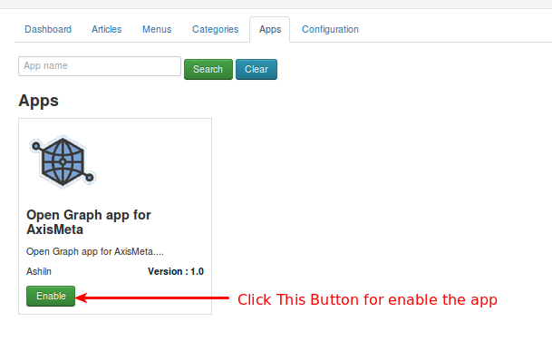
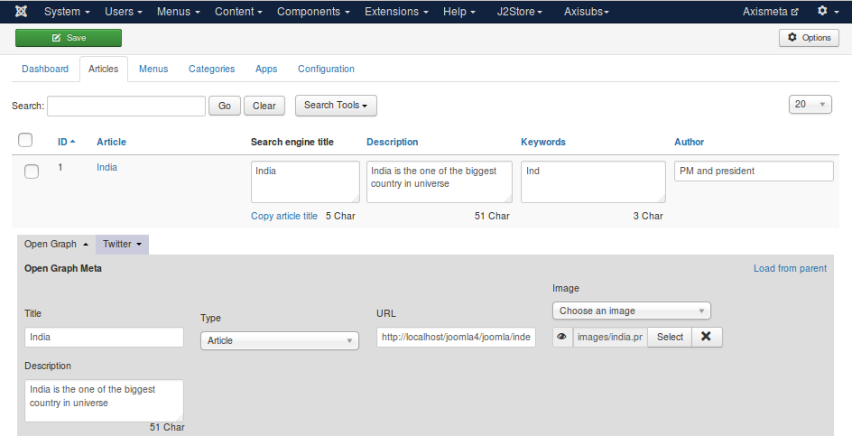
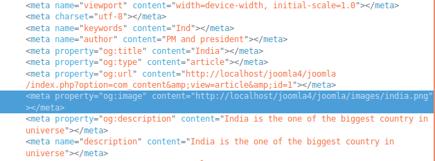
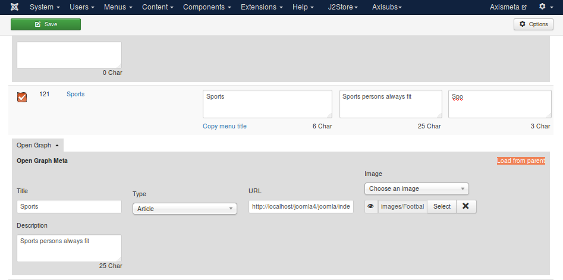
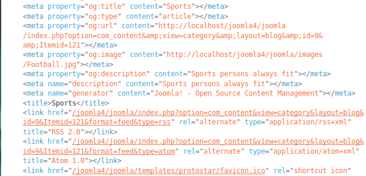
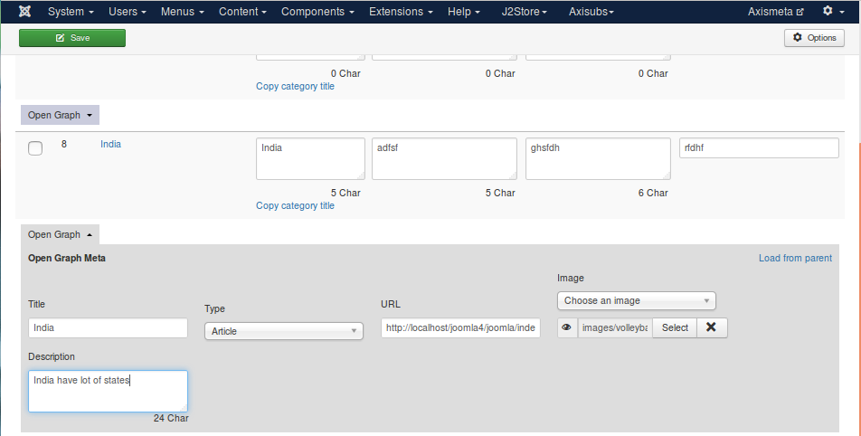
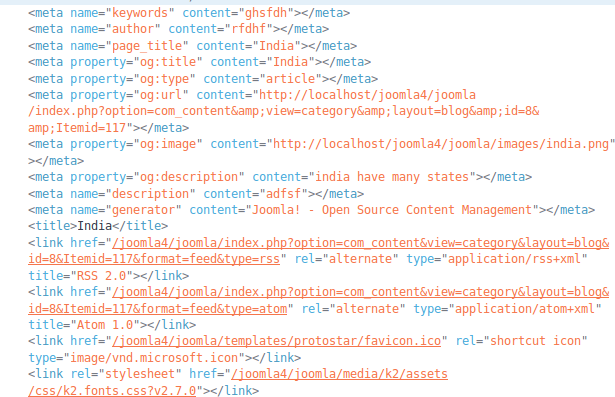

# Open Graph

#### What is open graph ?

The Open Graph protocol enables any web page to become a rich object in a social graph. For instance, this is used on Facebook to allow any web page to have the same functionality as any other object on Facebook.

While many different technologies and schemas exist and could be combined together, there isn't a single technology which provides enough information to richly represent any web page within the social graph. The Open Graph protocol builds on these existing technologies and gives developers one thing to implement. Developer simplicity is a key goal of the Open Graph protocol which has informed many of the technical design decisions.

#### Basic Meta  Datas

+ Title - The title of your object as it should appear within the graph, e.g., "The Rock".
 
+ Type - The type of your object. Depending on the type you specify, other properties may also be required.

+ Image - An image URL which should represent your object within the graph.

+ Url - The canonical URL of your object that will be used as its permanent ID in the graph .

+ Descriptions -A one to two sentence description of your object.

#### Configuration Open Graph

Axis meta -> Apps -> enable the open graph

Now , the open graph will appear on the following things in the axis meta  articles, menus and categories.

#### Article
 Enter the data in the article tab as like below image
 
 

Now the output will displayed in the front end as like below image .

 

#### Menus

Fill the Open graph fields in the Menu tab as like below image .

Now the output will displayed in the fron end as like below image .

#### Categories
Fill the Open graph fields in the categories tab as like below image .

Now the output will displayed in the fron end as like below image .

