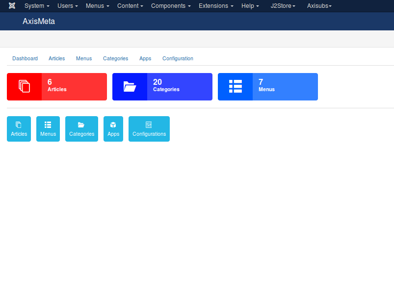
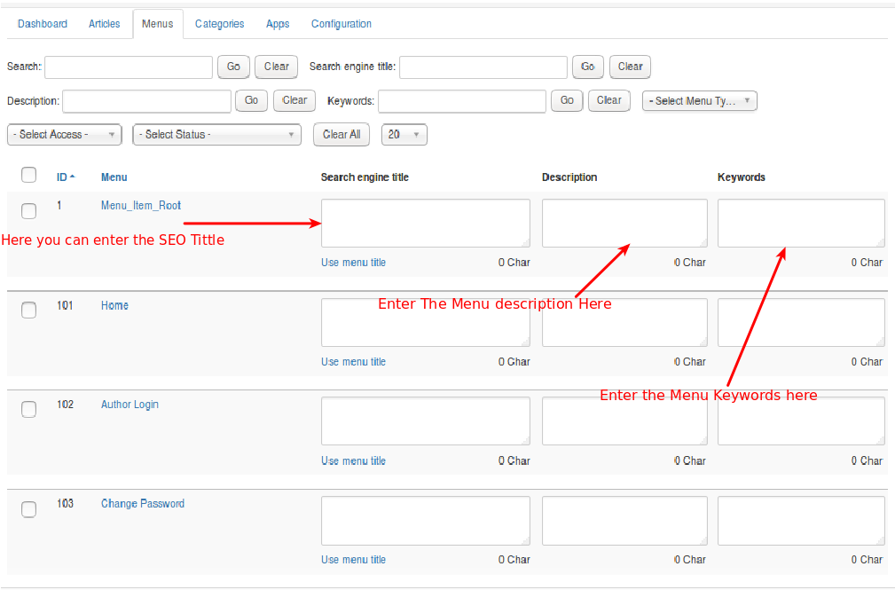

#### Working with AxisMeta

There are several sections includes in AxisMeta. Sections are given below

**[Control Panel](#control_panel)**
**[Article Meta Data](#article_metadata)**
**[Menu Meta Data](#menu_metadata)**
**[Category Meta Data](#category_metadata)**
**[Configuration](#configuration)**
**[Apps](#apps)**

#### Control Panel

It is the dashboard of AxisMeta. It will display you the total number of Articles, Menus, Categories in your site. Refer the below image

####Articles
**NOTE:**The Article tab will display you all the articles which are created in your site with the following options:

    1. Search Engine Tittle
    2. Description
    3. Keywords
    4. Author

Here itself you can add the Meta description, keywords and all to all the articles. No need to open the article one by one to update.

* ***Search Engine Tittle***
A title tag is the main text that describes an online document. Title elements have long been considered one of the most important on-page SEO elements (the most important being overall content), and appear in three key places: browsers, search engine results pages, and external websites.

* ***Description***
The Article description tag allows you to provide a summary of the content on the page in one paragraph.If you have already entered the description of the article when it is created, Now you want to change That means through this tag you can easily achive this.

* ***Keywords***
A keyword, in the context of search engine optimization, is a particular word or phrase that describes the contents of a Web page.If You forgot to entering the keywords when the article is created means this tag will help you to enter the keywords for the relevant article.

* ***Author***
This allows you to show the different author for the article.

Refer the below image for your better understanding about the options presented in the article tab.

 

####Menus

 The Menu Tab will list the all menus which you have created in your site. If you want to Edit the menu means you can archive that through the options presented in the menu tab.

 Refer the below image for getting more details about Menus.

####Categories

 The category Tab will display the list of categories created in the site.If you want to edit the category means you can archive that through some options present in the categories tab.

 Refer the below image
 

####Apps

 AxisMeta just rolled out a couple of new apps that are going to make managing your online business even easier.

* ***Open Graph app for AxisMeta***
 The Open Graph protocol enables any web page to become a rich object in a social graph. For instance, this is used on Facebook to allow any web page to have the same functionality as any other object on Facebook.

 While many different technologies and schemas exist and could be combined together, there isn't a single technology which provides enough information to richly represent any web page within the social graph.

 The Open Graph protocol builds on these existing technologies and gives developers one thing to implement. Developer simplicity is a key goal of the Open Graph protocol which has informed many of the technical design decisions.

Refer the below image

####configuration

There are several options available for your axis meta. Any mis-configuration here will affect your sitefront's behaviour. So take your time and configure the axis meta correctly.

The configuration page has several tabs. Each one is explained in detail. They are:

## Basic options

Some basic settings need to be done before you proceed. This will be handled by the following options.

 * ***Canonical URL***
This article describes how you can use canonical URLs to improve link and ranking signals for content available through multiple URL structures or via syndication.

Refer the Below image

